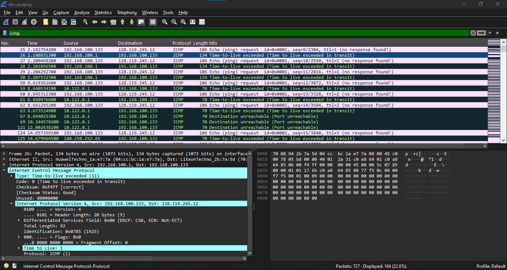
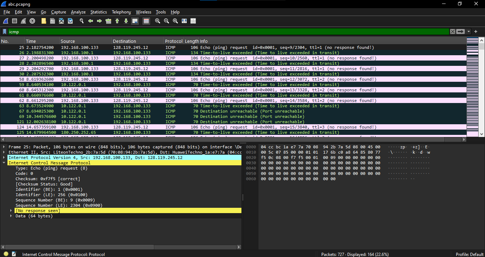

# Modul 10 — IP (Internet Protocol)
### Datagram IPv4 dan IPv6 menggunakan Wireshark

---

## Daftar Isi
- [Alat yang Perlu Disiapkan](#alat-yang-perlu-disiapkan)
- [Hasil Analisis IPv4](#hasil-analisis-ipv4)
- [Investigasi IPv6](#investigasi-ipv6)

---

## Alat yang Perlu Disiapkan
* **Wireshark** — untuk menangkap dan membaca paket
* **Terminal/CMD** — untuk menjalankan `ping` dan `traceroute`/`tracert`
* **Browser** — untuk memicu trafik HTTP/IP tambahan

---

## Hasil Analisis IPv4

Capture dilakukan sambil menjalankan `tracert gaia.cs.umass.edu`. Berikut analisis header IPv4 pada paket ICMP Echo Request yang dikirim:

| Field | Nilai | Keterangan |
|---|---|---|
| Source Address | `192.168.56.1` | Alamat IP pengirim |
| Destination Address | `128.119.245.12` | Alamat IP server tujuan |
| Protocol | `ICMP (1)` | Protokol lapisan atas yang dibawa |
| Header Length | `20 byte` | Ukuran header standar tanpa opsi tambahan |
| Total Length | `92 byte` | Total ukuran header + payload |

### Analisis Time to Live (TTL)
Setiap kali paket melewati satu router (satu *hop*), nilai TTL pada header dikurangi 1. Nilai TTL pada paket balasan yang kembali dari masing-masing hop ini bisa dipakai untuk memperkirakan "jarak logis" router tersebut dari host. Jika TTL mencapai 0, router akan membuang paket tersebut dan mengirim balik pesan **ICMP Time Exceeded** ke pengirim — mekanisme inilah yang sebenarnya dipakai `traceroute` untuk memetakan rute.

---

## Investigasi IPv6
Dibandingkan IPv4, datagram IPv6 punya beberapa perbedaan mendasar:
* **Alamat IPv6** memakai format 128-bit, jauh lebih panjang dari IPv4 yang hanya 32-bit, sehingga ruang alamatnya jauh lebih luas.
* **Header IPv6** dibuat lebih sederhana dengan ukuran tetap 40 byte. Field-field seperti *Checksum* dan *Fragmentation* yang ada di IPv4 dihilangkan dari header utama IPv6 supaya proses di router menjadi lebih cepat.
* **IPv6** juga menyediakan field *Flow Label* yang bisa dimanfaatkan untuk keperluan Quality of Service (QoS), sesuatu yang tidak ada secara native pada header IPv4.

## Kesimpulan
Header IP — baik versi 4 maupun 6 — pada dasarnya bertugas membawa informasi alamat sumber dan tujuan supaya paket bisa dirutekan lewat jaringan, sekaligus menyediakan mekanisme kontrol seperti TTL agar paket tidak berputar-putar selamanya di jaringan jika terjadi loop routing.
