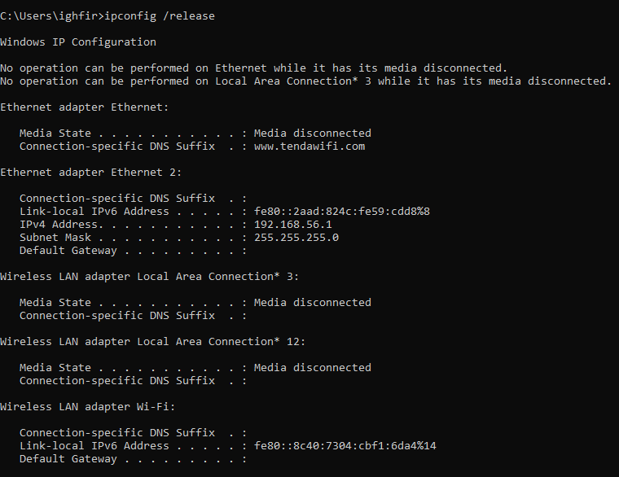
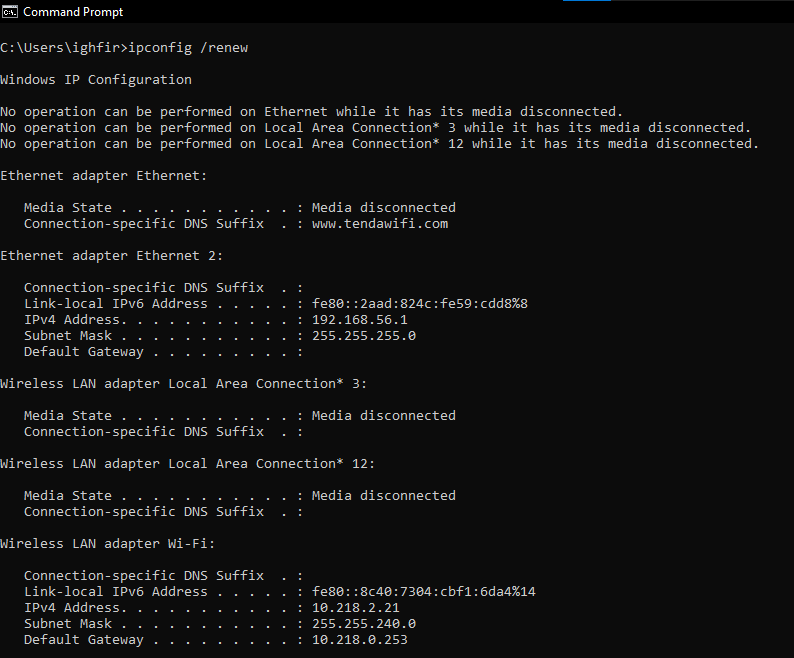
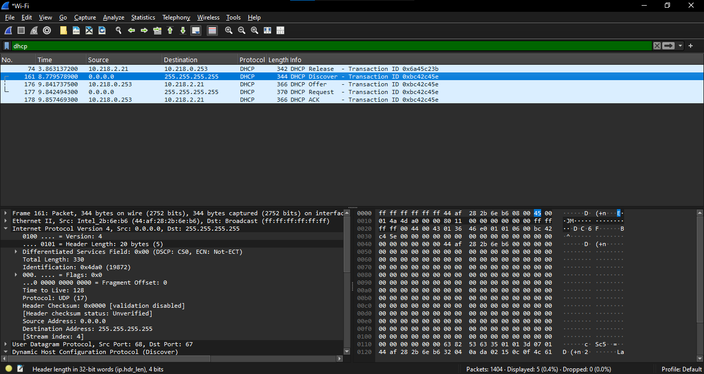

# Modul 11 — DHCP (Dynamic Host Configuration Protocol)
### Mekanisme Pengalamatan Dinamis menggunakan Wireshark

---

## Daftar Isi
- [Dasar Teori (Proses DORA)](#dasar-teori-proses-dora)
- [Langkah Praktikum](#langkah-praktikum)
- [Analisis Paket DHCP](#analisis-paket-dhcp)
- [Kesimpulan](#kesimpulan)

---

## Dasar Teori (Proses DORA)
DHCP memberikan alamat IP ke client lewat empat tahap, biasa disingkat **DORA**:
1. **Discover** — client menyiarkan (broadcast) pesan untuk mencari server DHCP yang tersedia di jaringan.
2. **Offer** — server membalas dengan tawaran alamat IP beserta parameter konfigurasi lainnya (subnet mask, gateway, dll).
3. **Request** — client secara resmi meminta alamat IP yang ditawarkan tersebut.
4. **ACK** — server memberi konfirmasi akhir bahwa alamat IP itu sah dipinjamkan (*lease*) ke client.

---

## Langkah Praktikum
1. Jalankan Wireshark, pilih interface jaringan yang aktif.
2. Terapkan filter `dhcp` atau `bootp`.
3. Buka Terminal/CMD sebagai Administrator.
4. Jalankan `ipconfig /release` untuk melepas IP yang sedang dipakai.

5. Mulai capture di Wireshark.
6. Jalankan `ipconfig /renew` untuk meminta IP baru dari server DHCP.

7. Setelah beberapa detik, hentikan capture.

---

## Analisis Paket DHCP

### 1. Lapisan Transport
DHCP berjalan di atas **UDP**, dengan:
* **Source Port**: 68 (client)
* **Destination Port**: 67 (server)

### 2. Identifikasi Pesan DORA

| Tipe Pesan | Source IP | Destination IP | Keterangan |
|---|---|---|---|
| Discover | `0.0.0.0` | `255.255.255.255` | Broadcast mencari server |
| Offer | `10.218.0.253` | `10.218.2.21` | Tawaran IP dari server |
| Request | `0.0.0.0` | `255.255.255.255` | Permintaan resmi dari client |
| ACK | `10.218.0.253` | `10.218.2.21` | Konfirmasi dari server |

### 3. Field Penting pada Header DHCP
* **Transaction ID** — angka unik (contoh: `0xbc42c45e`) yang dipakai untuk mencocokkan request client dengan response server yang sesuai, terutama saat ada beberapa proses DORA berjalan hampir bersamaan.
* **Client IP Address** — alamat IP yang ditawarkan server kepada client.

---

## Kesimpulan
Sifat *connectionless* DHCP terlihat jelas dari penggunaan UDP dan alamat broadcast `255.255.255.255` — wajar, karena di tahap awal client memang belum punya identitas IP sama sekali untuk berkomunikasi secara unicast. **Transaction ID** menjadi elemen krusial di sini, karena tanpanya, server tidak punya cara untuk memastikan balasannya sampai ke client yang benar di tengah lalu lintas broadcast yang ramai.
