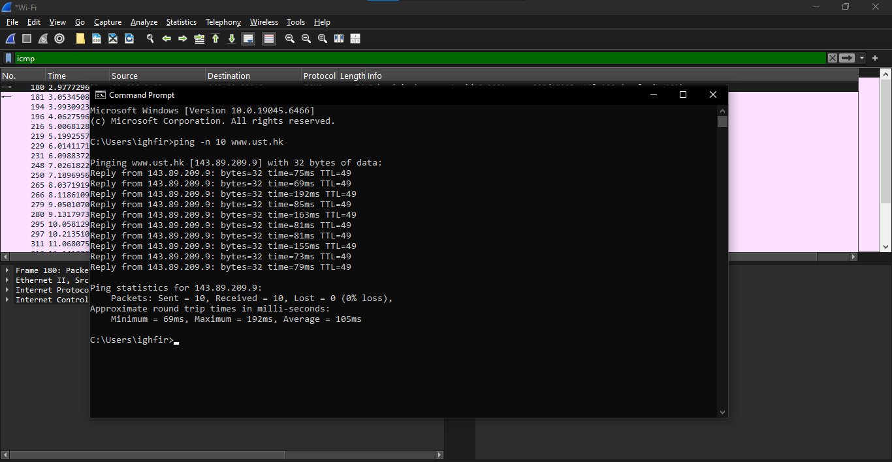
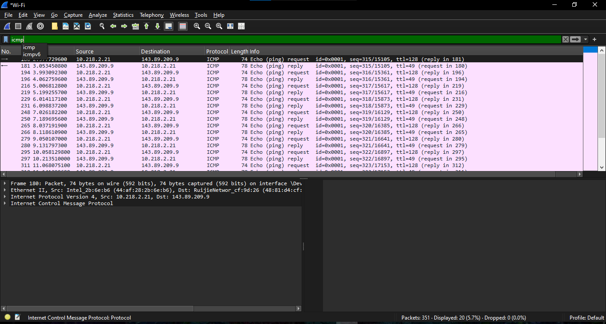
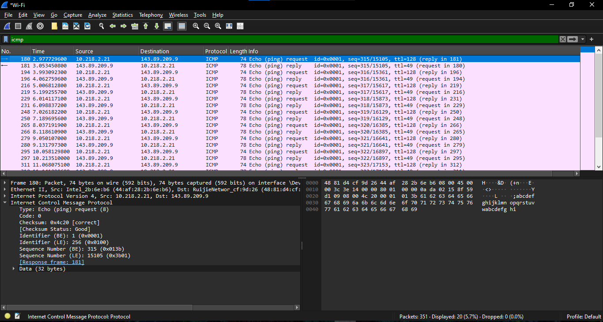
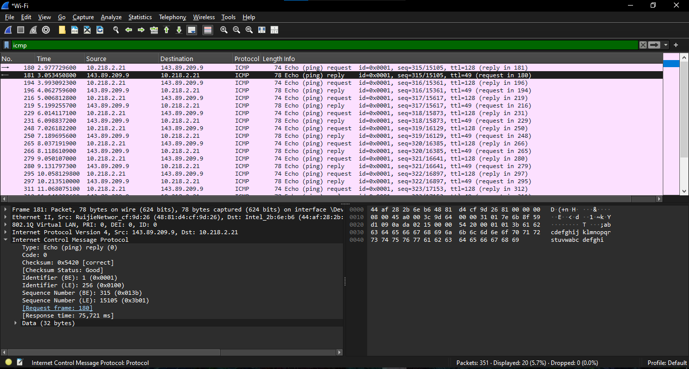
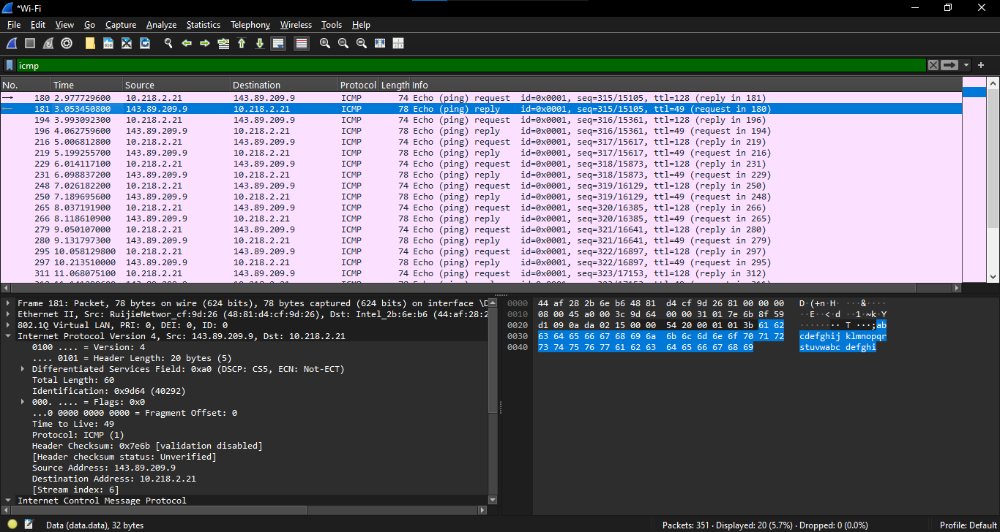
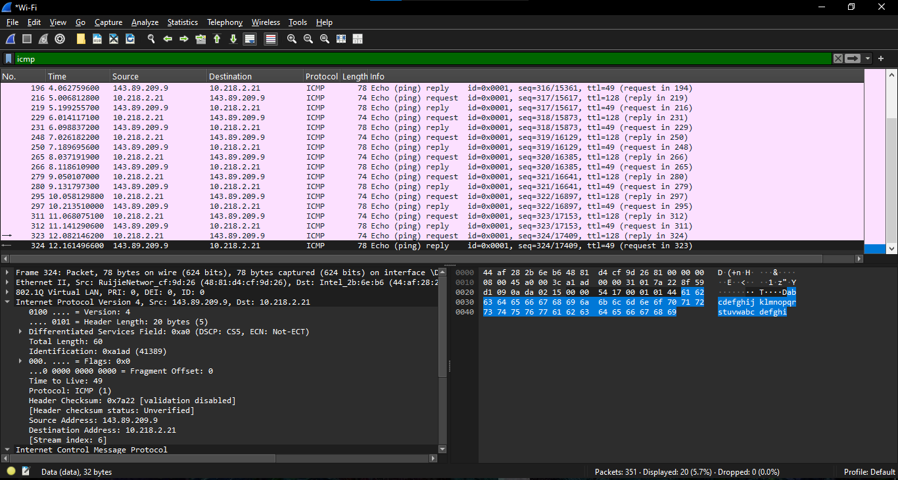
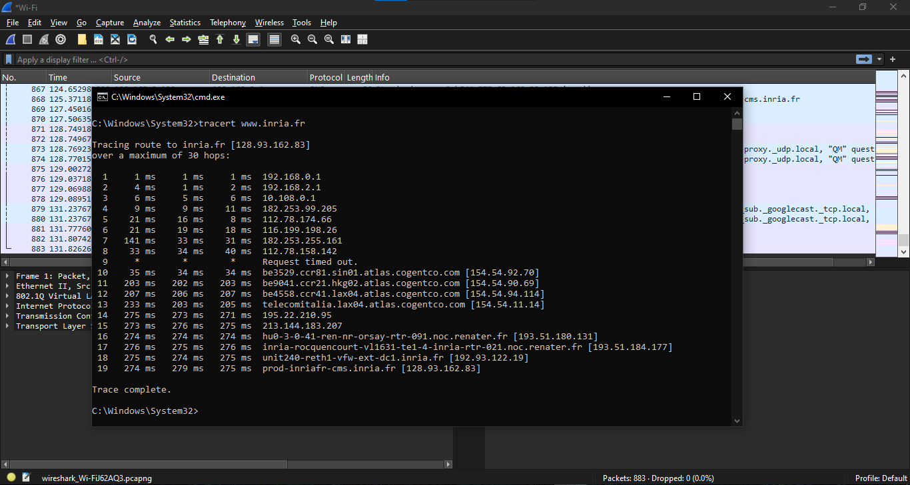
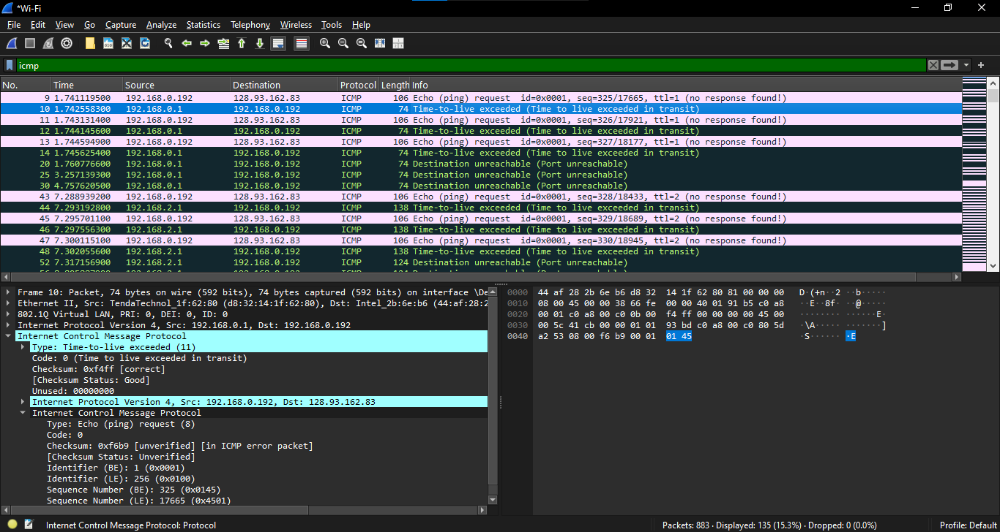

# Modul 12 — ICMP (Internet Control Message Protocol)
### Analisis Perilaku Pesan Kendali Jaringan dan Mekanisme Diagnostik Utilitas Jaringan

---

## Daftar Isi
- [Dasar Teori ICMP](#dasar-teori-icmp)
- [Eksperimen 1: Analisis Paket ICMP Ping](#eksperimen-1-analisis-paket-icmp-ping)
- [Eksperimen 2: Analisis Paket ICMP Traceroute](#eksperimen-2-analisis-paket-icmp-traceroute)

---

## Dasar Teori ICMP
ICMP dipakai oleh host dan router untuk saling berkomunikasi di level network layer, terutama untuk *error reporting* dan kueri diagnostik. ICMP dibungkus langsung di dalam datagram IP (field Protocol = 1).

Header ICMP punya 3 field utama yang selalu ada di setiap tipe pesan:
* **Type (8 bit)** — menentukan kategori besar dari pesan ICMP (misalnya Echo Request, Echo Reply, Time Exceeded).
* **Code (8 bit)** — sub-kategori lebih spesifik dari nilai Type.
* **Checksum (16 bit)** — memastikan data ICMP tidak rusak selama transmisi.

---

## Eksperimen 1: Analisis Paket ICMP Ping

Skenario dijalankan dengan perintah `ping -n 10 www.ust.hk` di terminal Windows, yang memicu 10 kali pertukaran pesan Echo Request/Reply secara berurutan.

### 1. Alur Transmisi Paket
Dari hasil capture, pengujian konektivitas ke `www.ust.hk` (`143.89.209.9`) dari IP lokal host (`10.218.2.21`) menghasilkan rangkaian pasangan Echo Request–Reply secara sekuensial, terlihat pada daftar paket Wireshark berikut.

### 2. Bedah Struktur Header ICMP

#### A. Paket Echo Request (Outbound)
Paket yang dikirim dari komputer client ke server target:
* **Type**: `8` (Echo/Ping request)
* **Code**: `0`
* **Checksum**: `0x4c20` (valid)
* **Identifier (BE)**: `1` (`0x0001`)
* **Identifier (LE)**: `256` (`0x0100`)
* **Sequence Number (BE)**: `315` (`0x013b`)
* **Sequence Number (LE)**: `15105` (`0x3b01`)
* **Payload**: data standar sebesar 32 byte

Header IP dari paket request ini menunjukkan TTL `128` — nilai default Windows untuk paket keluar.

#### B. Paket Echo Reply (Inbound)
Paket balasan dari server `143.89.209.9` ke client:
* **Type**: `0` (Echo/Ping reply)
* **Code**: `0`
* **Checksum**: `0x5420` (valid)
* **Identifier (BE/LE)**: sama dengan paket request — `1` / `256`
* **Sequence Number (BE/LE)**: sama dengan paket request — `315` / `15105`
* **Payload**: sama, 32 byte

**Analisis**: kesamaan nilai *Identifier* dan *Sequence Number* antara request dan reply adalah mekanisme krusial bagi sistem operasi pengirim untuk mencocokkan balasan mana yang merespons permintaan mana — dari situ jugalah nilai *Round-Trip Time* (RTT) bisa dihitung secara presisi.

Pada beberapa paket reply lain di trace yang sama, header IP-nya juga sempat diperiksa untuk melihat detail TTL dan checksum-nya:

Pada kedua frame ini terlihat TTL balasan bernilai `49` — berbeda dari TTL `128` pada paket request, karena nilai TTL pada paket reply sudah dikurangi sebanyak jumlah hop router yang dilewati dalam perjalanan dari server `143.89.209.9` balik ke client.

---

## Eksperimen 2: Analisis Paket ICMP Traceroute

Skenario kedua menjalankan `tracert www.inria.fr`, yang bekerja dengan memanipulasi nilai TTL pada header IP secara bertahap, dimulai dari TTL = 1.

### 1. Hasil Eksekusi `tracert` di Terminal

Dari `C:\Windows\System32` lewat Command Prompt/PowerShell, hasil log menunjukkan:
* **Hop 1**: menuju default gateway jaringan lokal kampus di `10.252.241.1`, dengan waktu respons sangat cepat — `1 ms`, `1 ms`, `1 ms` — menandakan segmen LAN lokal sangat efisien.
* **Hop-hop berikutnya**: paket diteruskan keluar dari jaringan lokal menuju ISP publik, sebelum akhirnya diarahkan ke rute transnasional menuju server tujuan di Prancis.

### 2. Analisis Paket pada Wireshark

#### A. Paket Request dari Client (`192.168.0.192`)
Berbeda dari sistem Unix/Linux yang biasanya menggunakan probe UDP di port tinggi, utilitas `tracert` Windows justru menggunakan paket **ICMP Echo Request**.
* **Type**: `8` | **Code**: `0`
* **Manipulasi TTL**: paket pertama dikirim dengan TTL = 1, paket berikutnya TTL = 2, TTL = 3, dan seterusnya — bertambah satu setiap kali.

#### B. Paket Respons dari Router Perantara
Ketika paket dengan TTL = 1 sampai di router lompatan pertama, nilai TTL-nya dikurangi 1 oleh router sehingga menjadi 0. Karena TTL sudah 0, router membuang paket tersebut dan mengirim balik pesan error ke host:
* **Type**: `11` (Time-to-live exceeded)
* **Code**: `0` (Time to live exceeded in transit)
* **Checksum**: `0xf4ff` (valid)
* **Payload**: router menyertakan salinan header IP asal beserta data payload asli yang dibuangnya, supaya stack protokol di komputer client tahu persis paket request mana yang memicu *error drop* tersebut.

---

## Kesimpulan
Lewat dua eksperimen ini terlihat dua peran utama ICMP: sebagai alat uji konektivitas sederhana lewat Echo Request/Reply (`ping`), dan sebagai mekanisme pelaporan error yang justru "dimanfaatkan" oleh `tracert`/`traceroute` lewat manipulasi TTL bertahap untuk memetakan rute jaringan hop demi hop. Identifier, Sequence Number, dan TTL menjadi tiga elemen kunci yang membuat kedua mekanisme ini bisa bekerja dengan presisi.
