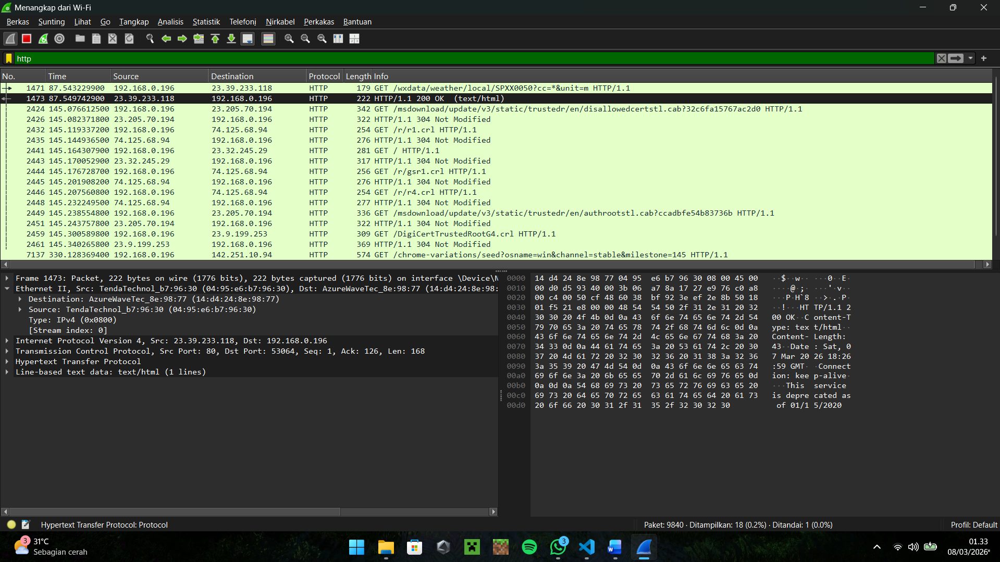

# Modul 2 — Pengenalan Wireshark dan Packet Capture

## Tujuan
1. Memahami antarmuka dan fitur dasar Wireshark.
2. Mampu melakukan *capture* paket data pada jaringan yang sedang aktif.
3. Mampu memakai *display filter* untuk mencari protokol tertentu, dalam hal ini HTTP.
4. Memahami konsep enkapsulasi data dengan mengamati lapisan-lapisan protokol (HTTP, TCP, IPv4, Ethernet II) pada satu paket yang sama.

## Alat dan Bahan
* Laptop/PC dengan Wireshark yang sudah terinstal (lihat Modul 1)
* Koneksi jaringan (Wi-Fi atau LAN)
* Browser, untuk menghasilkan trafik HTTP yang bisa ditangkap

## Langkah Percobaan

### A. Memulai Capture
1. Buka Wireshark, lalu pilih antarmuka jaringan yang sedang dipakai untuk koneksi internet (misalnya `Wi-Fi`).
2. Klik dua kali pada antarmuka tersebut, atau klik ikon sirip hiu biru (**Start capturing packets**) di pojok kiri atas.
3. Buka browser dan kunjungi situs web apa saja untuk memicu trafik data.

### B. Menerapkan Display Filter
1. Pada kolom *display filter* di bagian atas jendela Wireshark, ketik `http` (huruf kecil semua, tanpa tanda kutip).
2. Tekan **Enter**, atau klik tombol **Apply** (ikon panah biru di sebelah kolom filter).
3. Daftar paket yang tampil sekarang hanya berisi paket-paket yang berprotokol HTTP — paket lain seperti DNS, TCP handshake murni, atau ARP otomatis tersembunyi.

### C. Membongkar Enkapsulasi Paket HTTP
1. Klik salah satu baris HTTP yang muncul di *Packet List*.
2. Perhatikan panel *Packet Details* di tengah. Setiap baris di panel ini mewakili satu lapisan protokol.
3. Klik tanda `>` pada masing-masing baris untuk melihat isinya secara detail:
   * **Hypertext Transfer Protocol (HTTP)** — pesan level aplikasi, berisi method (GET/POST), header, dan body.
   * **Transmission Control Protocol (TCP)** — menunjukkan bahwa pesan HTTP tadi sebenarnya dikirim sebagai data di dalam segmen TCP.
   * **Internet Protocol Version 4 (IPv4)** — segmen TCP tersebut kemudian dibungkus lagi di dalam datagram IP, lengkap dengan alamat IP sumber dan tujuan.
   * **Ethernet II** — pada lapisan paling bawah, datagram IP dibungkus dalam frame Ethernet supaya bisa dikirim lewat media fisik (kabel/Wi-Fi).
4. Dengan melihat keempat lapisan ini sekaligus pada satu paket, terlihat jelas bagaimana satu pesan HTTP "dibungkus berlapis" sebelum benar-benar dikirim ke jaringan — inilah yang disebut proses enkapsulasi.

### D. Menghentikan Capture
1. Setelah analisis cukup, klik ikon kotak merah (**Stop capturing packets**) di toolbar untuk mengakhiri penangkapan.

## Hasil

Dari hasil di atas terlihat daftar paket HTTP yang sudah terfilter, beserta detail enkapsulasi salah satu paketnya. Latihan ini menjadi dasar penting sebelum masuk ke analisis protokol yang lebih spesifik pada modul-modul berikutnya.
