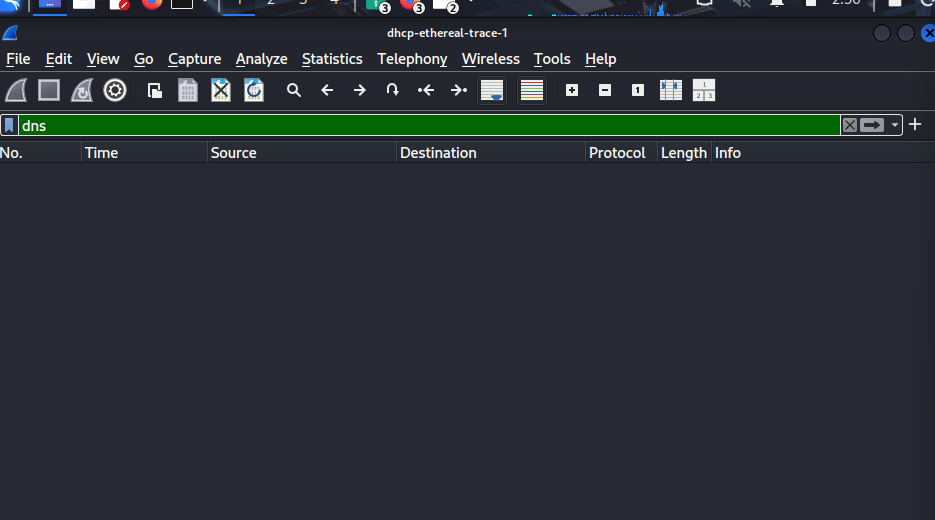
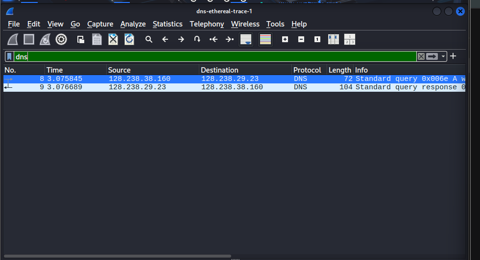
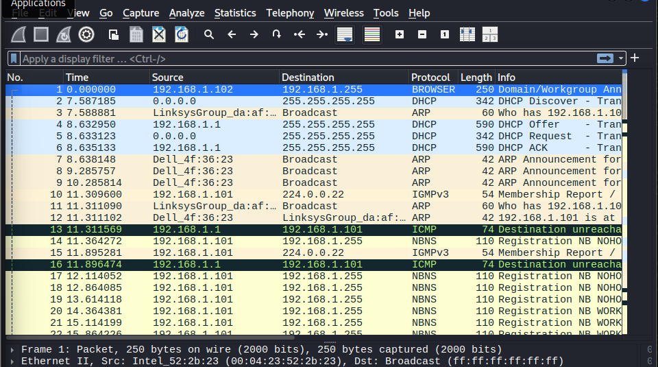
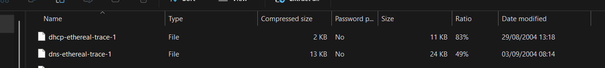
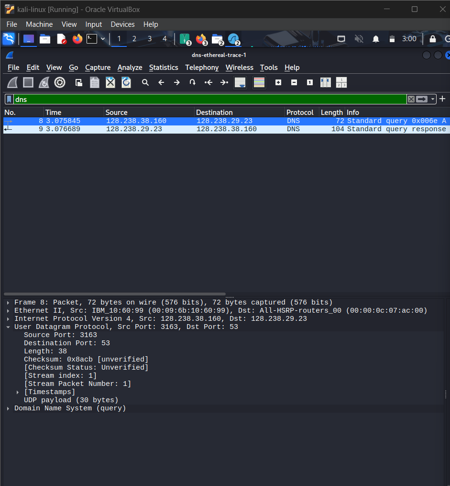
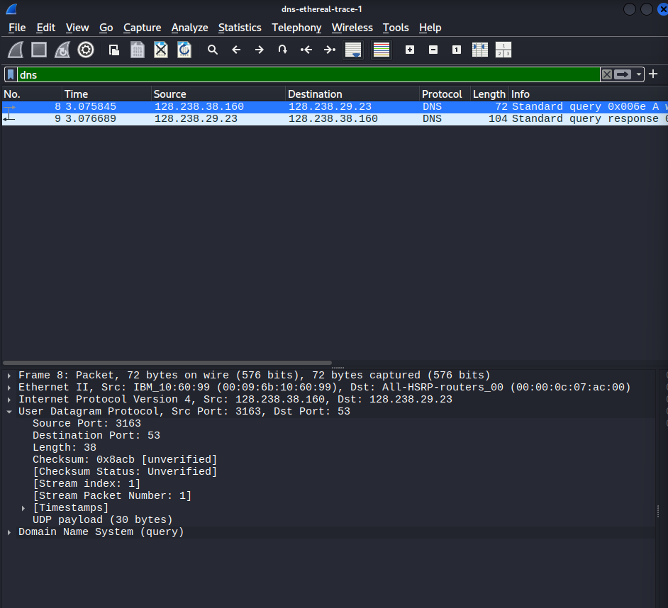
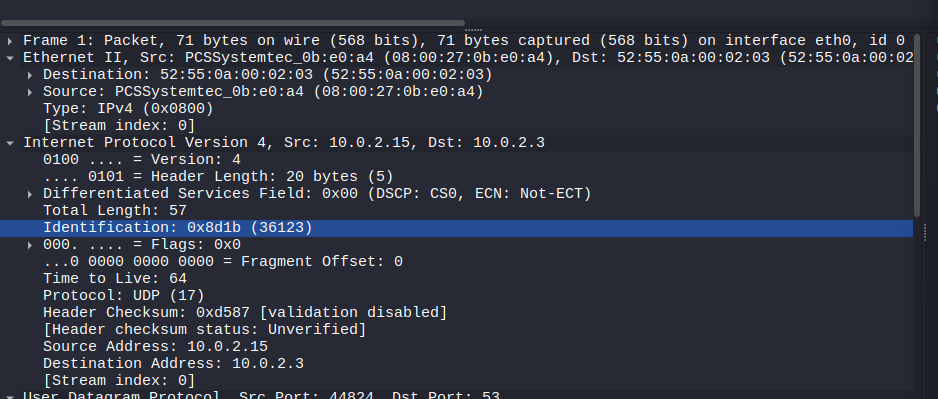
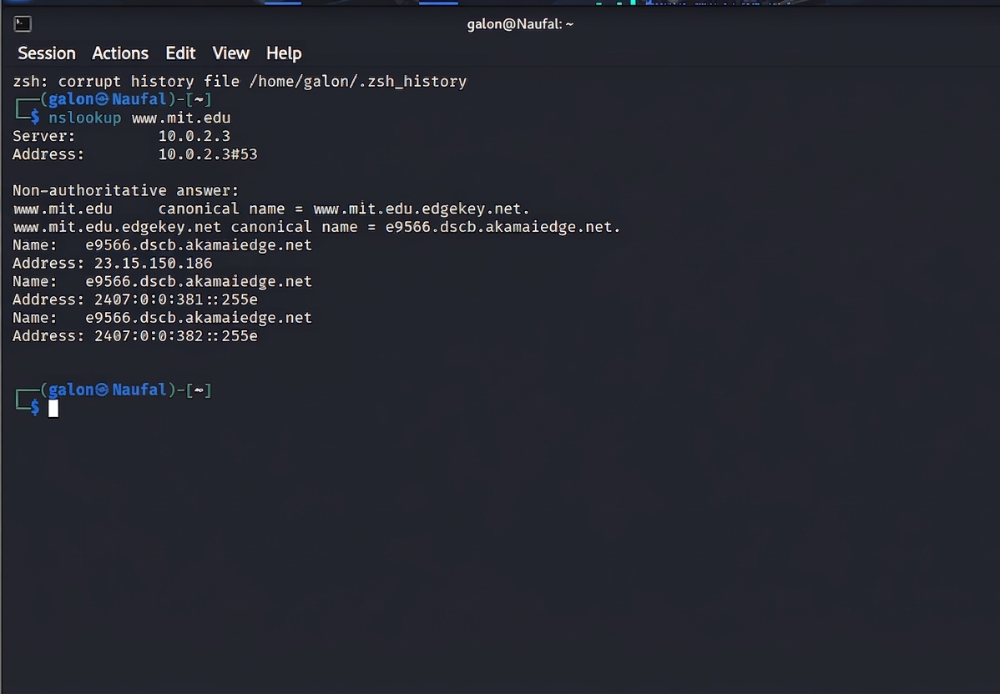
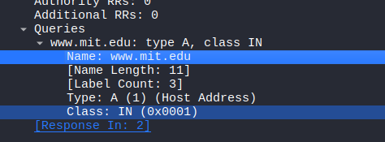
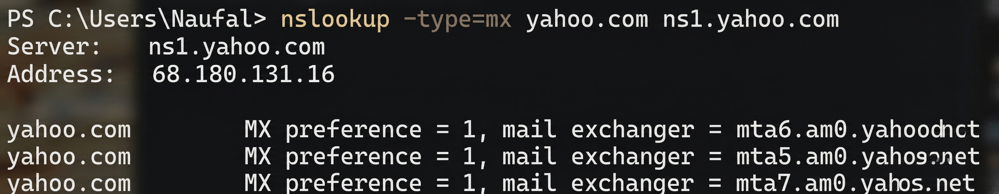

# Modul 4 — Analisis Protokol DNS

Modul ini membahas DNS dari dua sisi: membaca trace Wireshark yang sudah disediakan, dan menjalankan `nslookup` sendiri untuk melihat proses resolusi nama domain secara langsung.

---

## Eksperimen 1 — Membaca Trace DNS (`dns-ethereal-trace-1`)

Sebelum menganalisis paket DNS-nya secara spesifik, langkah pertama adalah membuka file trace di Wireshark, lalu mencoba menerapkan filter `dns`.

Percobaan pertama justru salah membuka file — trace yang dibuka adalah `dhcp-ethereal-trace-1`, sehingga ketika filter `dns` diterapkan, hasilnya kosong sama sekali karena trace tersebut memang tidak berisi query DNS.

Setelah menyadari kesalahan dan membuka file trace yang benar (`dns-ethereal-trace-1`), filter `dns` langsung menampilkan dua paket: satu **query** dan satu **response**.

Sebagai pembanding, berikut tampilan trace tanpa filter sama sekali — daftar paket di sini jauh lebih ramai karena memuat semua jenis trafik (DHCP, ARP, IGMP, NBNS, ICMP), bukan hanya DNS.

### 1. Protokol Transmisi DNS
Query dan response DNS sama-sama dikirim lewat **UDP**, terlihat pada kolom protokol di detail paket nomor 8.

UDP dipilih karena DNS membutuhkan kecepatan tinggi dengan overhead serendah mungkin — sebuah query DNS biasanya sangat singkat, jadi tidak butuh proses handshake seperti TCP.

### 2. Port Sumber dan Tujuan
Berdasarkan paket nomor 8:

* **Query**: Source Port `3163`, Destination Port `53`
* **Response**: Source Port `53`, Destination Port `3163`

Port 53 adalah port standar yang dipakai server DNS di seluruh dunia.

### 3. Alamat IP Tujuan dan DNS Lokal
* Alamat IP tujuan pada trace: `128.238.29.23`

* Alamat IP lokal komputer (hasil `ip addr`) adalah `10.0.2.15` pada interface `eth0`:

Kedua alamat ini **berbeda**, karena IP di Wireshark adalah server DNS milik pembuat trace aslinya, sedangkan IP lokal adalah konfigurasi jaringan komputer yang dipakai untuk membuka trace tersebut sekarang.

### 4. Pemeriksaan DNS Query
* **Type**: A (Host Address)
* **Answers**: 0 — query memang hanya berisi pertanyaan, belum ada jawabannya

Query ini hanya menanyakan alamat IPv4 dari `www.ietf.org`.

### 5. Pemeriksaan DNS Response
Response berisi **2 jawaban**:
1. `www.ietf.org` → `132.151.6.75`
2. `www.ietf.org` → `65.246.255.51`

Detail ini terlihat pada bagian *Answers*, lengkap dengan TTL sebesar 1678 detik.

### 6. Verifikasi Alamat IP pada TCP SYN
Setelah resolusi DNS selesai, host mengirim paket **TCP SYN** (paket nomor 10) untuk memulai koneksi HTTP ke alamat IP hasil resolusi tadi. Tujuannya adalah `132.151.6.75` — cocok dengan salah satu alamat yang diberikan server DNS pada response sebelumnya.

### 7. Apakah Perlu Query DNS Baru untuk Mengambil Gambar?
Tidak perlu. Begitu alamat IP `www.ietf.org` sudah didapat, host langsung mengirim HTTP GET untuk mengambil gambar (misalnya `ietflogo2e.gif`) menggunakan IP yang sama tanpa query DNS ulang.

Ini karena sistem operasi menyimpan hasil resolusi tadi di **DNS cache** selama rentang waktu sesuai TTL-nya, jadi tidak perlu bertanya berulang-ulang ke server DNS untuk domain yang sama.

---

## Eksperimen 2 — `nslookup` untuk `www.mit.edu`

### 1. Port Tujuan dan Sumber
* **Query**: Destination Port `53`
* **Response**: Source Port `53` (port standar DNS)

### 2. Alamat IP Tujuan Query
Query dikirim ke `10.0.2.3` — alamat ini adalah DNS server lokal default sistem, sesuai konfirmasi dari hasil `nslookup` yang menunjukkan `Address: 10.0.2.3#53`.

### 3. Pemeriksaan Query
* **Type**: A (mencari alamat IPv4)
* **Answer RRs**: 0 — query belum mengandung jawaban

### 4. Pemeriksaan Response
**Jumlah Answer**: 3, isinya:
1. `www.mit.edu` adalah CNAME (alias) dari `www.mit.edu.edgekey.net`
2. `www.mit.edu.edgekey.net` adalah CNAME dari `e9566.dscb.akamaiedge.net`
3. `e9566.dscb.akamaiedge.net` memiliki alamat IP `23.15.150.186` (Type A)

Rangkaian CNAME ini menunjukkan bahwa domain MIT sebenarnya dilayani lewat jaringan CDN Akamai, bukan langsung ke server MIT.

---

## Eksperimen 3 — Eksplorasi `nslookup` Lanjutan

### A. Alamat IP Server Web di Asia
Pengujian dilakukan terhadap domain pemerintah Indonesia, `www.jombangkab.go.id`:
* **Command**: `nslookup www.jombangkab.go.id`
* **IPv4**: `103.225.242.140`
* **IPv6**: `64:ff9b::67e1:f28c`

### B. Server DNS untuk Universitas di Eropa
Pengujian terhadap Universitas Oxford (`www.ox.ac.uk`) menunjukkan domain ini menggunakan Cloudflare sebagai bagian dari infrastrukturnya:
* **Command**: `nslookup www.ox.ac.uk`
* **CNAME**: `www.ox.ac.uk.cdn.cloudflare.net`
* **IP terdeteksi**: `172.66.169.161` dan `104.20.34.13`

### C. Server Email (MX Record) Yahoo! Mail
Query dijalankan dengan tipe `mx` untuk domain `yahoo.com`, lewat server DNS `ns1.yahoo.com`:
* **Command**: `nslookup -type=mx yahoo.com ns1.yahoo.com`
* **DNS server yang dipakai**: `ns1.yahoo.com` (IP `68.180.131.16`)
* **Daftar Mail Exchanger**:
  1. `mta6.am0.yahoodns.net` (Preference 1)
  2. `mta5.am0.yahoodns.net` (Preference 1)
  3. `mta7.am0.yahoodns.net` (Preference 1)

---

## Eksperimen 4 — `nslookup -type=NS mit.edu`

### 1. Alamat IP Tujuan Query
Query DNS dikirim ke `10.0.2.3`, terlihat dari hasil `nslookup` di terminal:

Pada Wireshark, paket pertama juga memiliki *Destination* `10.0.2.3`:

Ya, ini adalah DNS server lokal default. Hasil `ipconfig` menunjukkan IP komputer adalah `192.168.56.1` (jaringan privat), dan sistem dikonfigurasi untuk bertanya ke resolver lokal di `10.0.2.3`.

### 2. Pemeriksaan Query
* **Type**: NS (Authoritative Name Server)
* **Answers**: tidak ada — `Questions: 1`, `Answer RRs: 0`, `Authority RRs: 0`

Sebuah query hanya berisi pertanyaan; jawaban baru muncul pada paket response.

### 3. Pemeriksaan Response
Server MIT dikelola oleh layanan Akamai. Beberapa nama Name Server yang diberikan:
`asia1.akam.net`, `usw2.akam.net`, `ns1-37.akam.net`, `use5.akam.net`, `eur5.akam.net`, `use2.akam.net`, `asia2.akam.net`, `ns1-173.akam.net`.

Ya, response juga menyertakan alamat IP-nya — pada bagian *"Authoritative answers can be found from"* tercantum IPv4 untuk masing-masing name server, contohnya `eur5.akam.net` beralamat `23.74.25.64`.

Pada bagian *Additional records*, terdapat 10 record tambahan — biasanya berisi *glue record* (alamat IP) supaya komputer bisa langsung menghubungi Name Server tersebut tanpa perlu resolusi DNS lagi.

### Tutorial Replikasi
1. Buka Wireshark, mulai capture pada interface yang aktif.
2. Ketik `dns` di kolom filter agar trafik lain tidak mengganggu.
3. Buka terminal, jalankan `nslookup -type=NS mit.edu`.
4. Klik paket **Query** (arah keluar) untuk melihat pertanyaan, lalu klik paket **Response** (arah masuk) untuk melihat daftar Name Server dan IP-nya di bagian *Answers*/*Additional Records*.

---

## Kesimpulan Umum
* DNS selalu berjalan di atas UDP port 53 demi kecepatan dan overhead rendah.
* Sebuah query hanya berisi pertanyaan (Answer RRs = 0); jawaban baru ada di paket response.
* Resolusi DNS bisa berupa rantai CNAME sebelum akhirnya sampai ke record Type A.
* Hasil resolusi disimpan di cache (sesuai TTL) sehingga objek lain di domain yang sama tidak perlu query DNS ulang.
* Query tipe NS dipakai untuk menemukan siapa saja Name Server otoritatif suatu domain, lengkap dengan glue record-nya.
