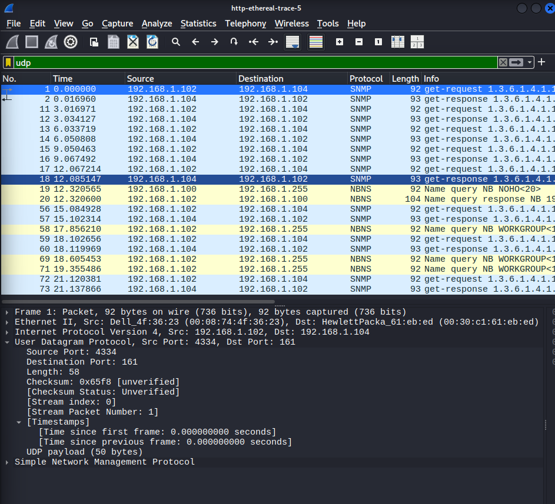

# Modul 5 — Analisis Protokol UDP

**File trace**: `http-ethereal-trace-5`, paket nomor 1 (SNMP)

## 1. Field pada Header UDP
Dilihat dari bagian *User Datagram Protocol* di Wireshark, header UDP terdiri dari **4 field**:
1. Source Port
2. Destination Port
3. Length
4. Checksum

## 2. Panjang Masing-masing Field
Dalam arsitektur TCP/IP, tiap field header UDP punya panjang tetap **2 byte (16 bit)**:
* Source Port: 2 byte
* Destination Port: 2 byte
* Length: 2 byte
* Checksum: 2 byte
* **Total header UDP: 8 byte**

## 3. Makna Field "Length" dan Verifikasinya
Nilai *Length* menyatakan panjang total segmen UDP, yaitu hasil dari **panjang header (8 byte) + panjang data/payload**.

Verifikasi pada paket di gambar yang sama (`po1.png`):
* Nilai field **Length**: 58
* Nilai **payload**: 50 byte
* Perhitungan: 8 byte (header) + 50 byte (payload) = 58 byte ✓ — sesuai dengan nilai Length yang tercatat.

## 4. Jumlah Maksimum Byte Payload UDP
Field *Length* terdiri dari 16 bit, sehingga nilai maksimumnya adalah:

$$2^{16} - 1 = 65.535 \text{ byte}$$

Nilai ini sudah termasuk 8 byte header, sehingga payload maksimumnya:

$$65.535 - 8 = 65.527 \text{ byte}$$

## 5. Nomor Port Terbesar
Field *Source Port* juga 16 bit, sehingga nomor port terbesar yang mungkin adalah:

$$2^{16} - 1 = 65.535$$

## 6. Nomor Protokol UDP
Dilihat dari bagian *Internet Protocol Version 4* pada header IP:

* **Desimal**: 17
* **Heksadesimal**: `0x11`

## 7. Hubungan Port pada Pasangan Request-Response
Berdasarkan trace:
* **Paket 1 (Request)**: dari `192.168.1.102` ke `192.168.1.104`
  * Source Port: `4334`
  * Destination Port: `161` (SNMP)
* **Paket 2 (Response)**: dari `192.168.1.104` ke `192.168.1.102`
  * Source Port: `161`
  * Destination Port: `4334`

**Kesimpulan**: nomor port pada kedua paket saling bertukar posisi (*swapped*). Port sumber pada request menjadi port tujuan pada response, dan sebaliknya — pola umum yang berlaku di hampir semua protokol request-response berbasis UDP maupun TCP.

## Catatan Tambahan
UDP tidak punya field untuk acknowledgement, sequence number, maupun flag koneksi seperti TCP. Header-nya jauh lebih ringkas (cuma 8 byte dibanding TCP yang minimal 20 byte), sehingga cocok dipakai untuk aplikasi yang mengutamakan kecepatan dibanding keandalan pengiriman, seperti DNS dan SNMP di atas.
