# Modul 6 — TCP (Transmission Control Protocol)
### Investigasi Handshake, Sequence Number, dan Congestion Control

---

## Daftar Isi
- [Prasyarat & Instalasi](#prasyarat--instalasi)
- [Langkah Praktikum](#langkah-praktikum)
- [Hasil & Analisis](#hasil--analisis)

---

## Prasyarat & Instalasi
* **Aplikasi**: Wireshark
* **File uji**: `alice.txt` (naskah ASCII *Alice in Wonderland*)
* **URL target**: `http://gaia.cs.umass.edu/wireshark-labs/TCP-wireshark-file1.html`
* **Koneksi jaringan**: dibutuhkan untuk proses upload file ke server jarak jauh

## Langkah Praktikum
1. Kosongkan cache browser.
2. Unduh `http://gaia.cs.umass.edu/wireshark-labs/alice.txt` dan simpan di komputer.
3. Buka halaman upload di `http://gaia.cs.umass.edu/wireshark-labs/TCP-wireshark-file1.html`.

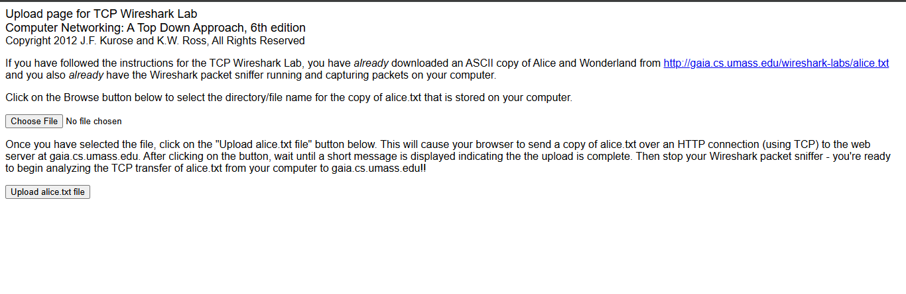

4. Klik **Browse** untuk memilih file `alice.txt`, tapi **jangan upload dulu**.
5. Buka Wireshark, mulai capture.
6. Baru klik tombol upload.

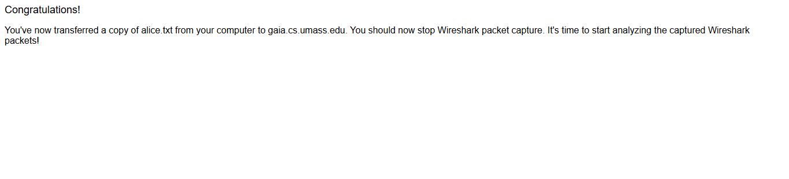

7. Ketik `tcp` di kolom filter Wireshark.

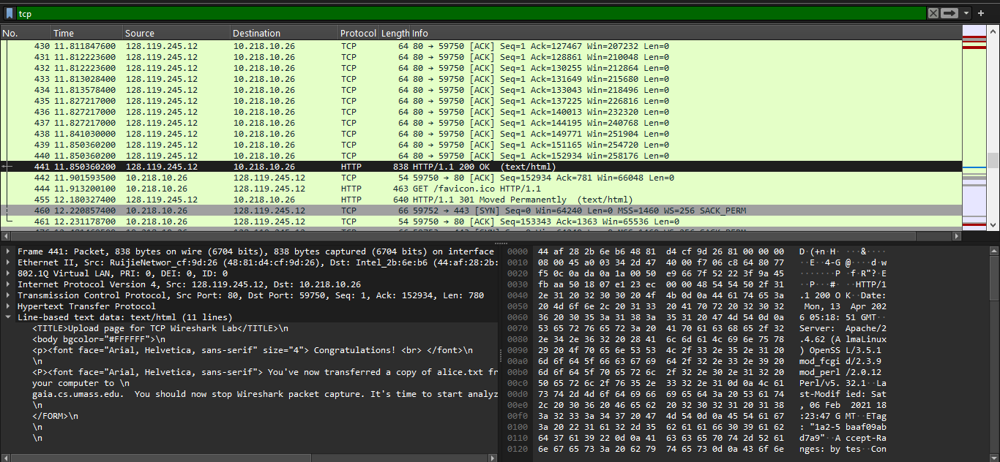

8. Selain trace `alice.txt`, file `tcp-etherealtrace-1` juga bisa diunduh dari `http://gaia.cs.umass.edu/wireshark-labs/wireshark-traces.zip` untuk dianalisis dengan cara yang sama.

---

## Hasil & Analisis

### Bundle 1

**1. Alamat IP dan port TCP komputer klien saat mengirim file ke gaia.cs.umass.edu?**

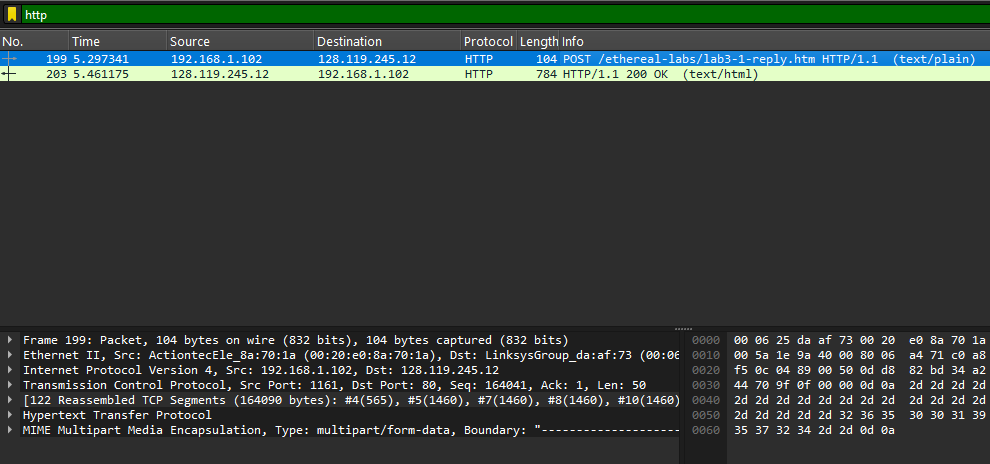

IP klien: `192.168.1.102`, port: `1161`.

**2. Alamat IP gaia.cs.umass.edu, dan port berapa yang dipakai untuk koneksi ini?**

IP server: `128.119.245.12`, port `80` — port standar untuk koneksi HTTP.

### Bundle 2

**1. Nomor urut segmen SYN, dan apa yang membuatnya teridentifikasi sebagai SYN?**

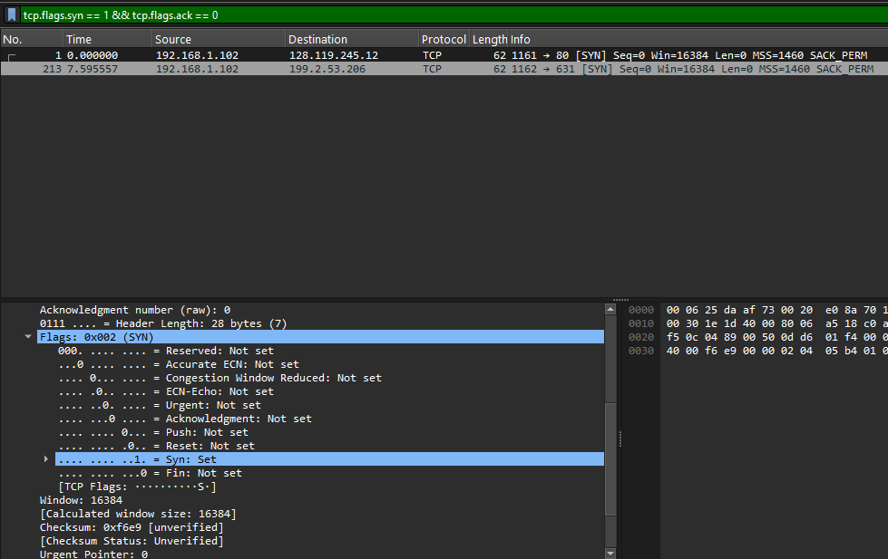

Dengan filter `tcp.flags.syn == 1 && tcp.flags.ack == 0`, nomor urut yang muncul adalah `0`. Segmen ini teridentifikasi sebagai SYN karena pada header TCP, bit `SYN` bernilai 1 sementara bit lainnya bernilai 0 — ini adalah ciri khas paket pembuka koneksi TCP.

**2. Nomor urut SYNACK, nilai Acknowledgement-nya, cara server menentukannya, dan ciri identifikasinya?**

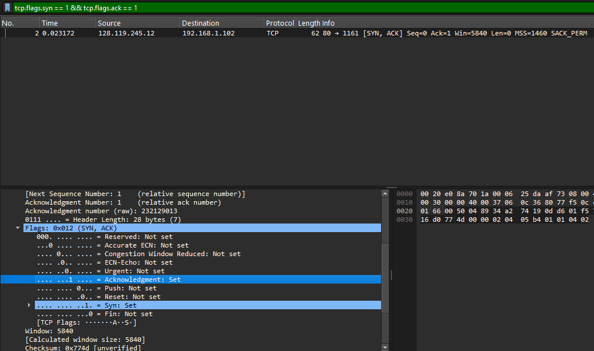

Dengan filter `tcp.flags.syn == 1 && tcp.flags.ack == 1`, nomor urutnya `0` dan nilai Acknowledgement-nya `1`. Server menentukan nilai Ack ini dengan mengambil Sequence Number dari paket SYN lalu menambah 1. Identifikasinya dilihat dari bit `SYN` dan `ACK` yang keduanya bernilai 1.

**3. Nomor urut segmen yang berisi HTTP POST?**

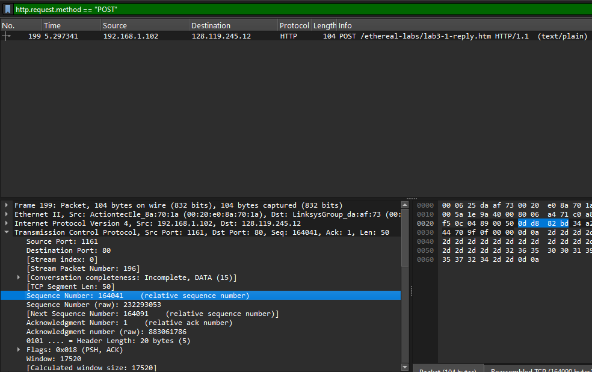
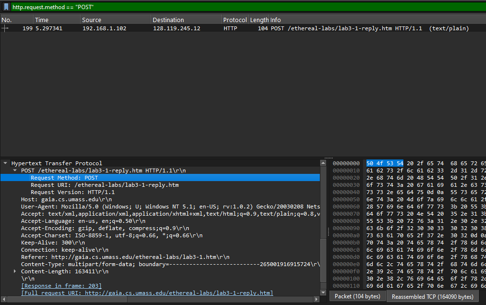

Dengan filter `http.request.method == "POST"`, ditemukan nomor urut `164041`, dan kata "POST" memang terlihat langsung di bagian data segmen tersebut.

**4. Enam segmen pertama (termasuk segmen POST): waktu kirim, waktu ACK diterima, RTT, dan EstimatedRTT?**

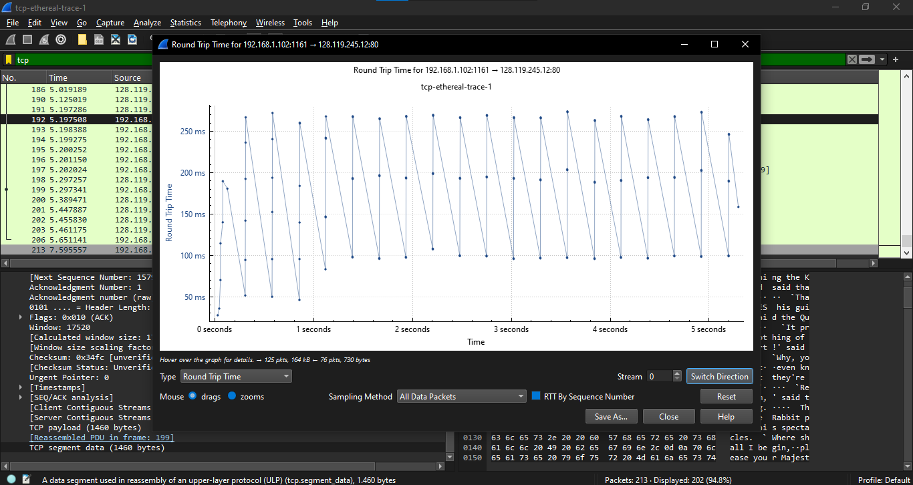

| No. | Seq | Waktu kirim | RTT |
|---|---|---|---|
| 192 | 156469 | 5.197508 | 0.099749 |
| 193 | 157929 | 5.198388 | 0.091083 |
| 194 | 159389 | 5.199275 | 0.098066 |
| 195 | 160849 | 5.200252 | 0.097089 |
| 196 | 162309 | 5.201150 | 0.096191 |
| 199 | 164041 | 5.297341 | 0.092130 |

**5. Panjang masing-masing dari enam segmen pertama?**

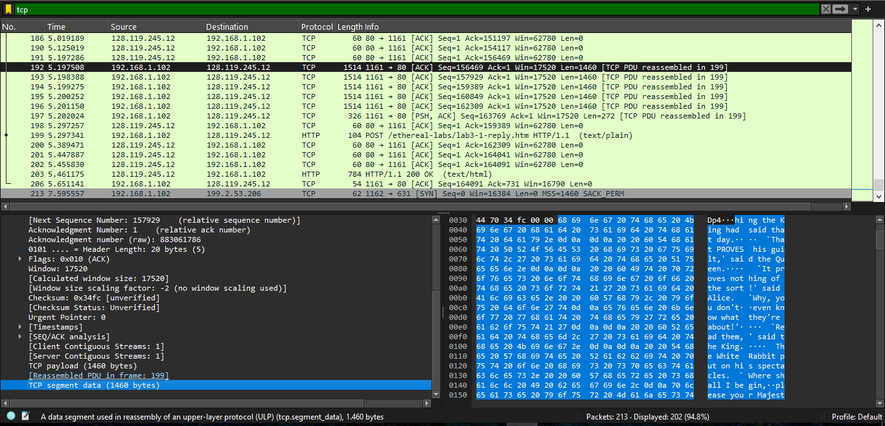

Panjangnya `1460 byte` — hasil dari batas standar Ethernet (1500 byte) dikurangi header IP (20 byte) dan header TCP (20 byte).

**6. Buffer space minimum yang direkomendasikan/diterima sepanjang trace, dan apakah buffer pernah menghambat pengiriman?**

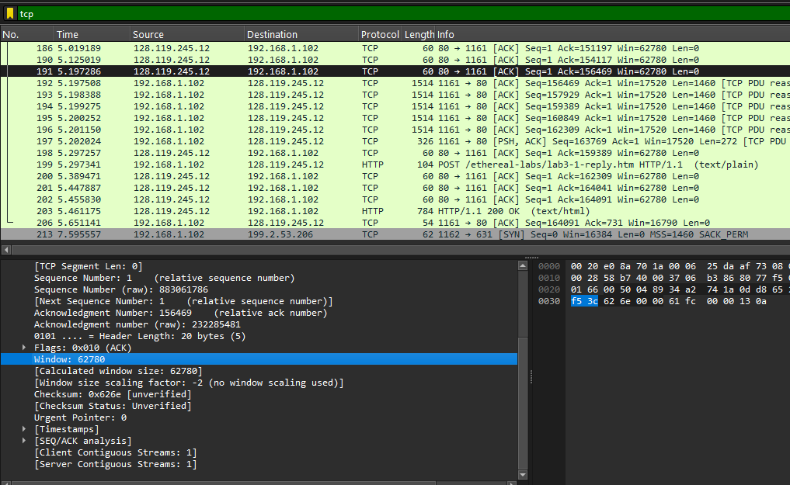

Ruang buffer untuk kasus ini stabil di `62780` sepanjang trace. Karena nilainya tidak pernah turun drastis, buffer tidak pernah menjadi penghambat pengiriman data.

**7. Apakah ada segmen yang ditransmisikan ulang?**

Tidak ada. Cara mengeceknya ada dua: mencari label `[TCP Retransmission]` di kolom info, atau melihat paket dengan latar belakang hitam dan teks merah (ciri visual retransmission di Wireshark) — keduanya tidak ditemukan di trace ini.

**8. Berapa banyak data yang biasanya diakui dalam satu ACK?**

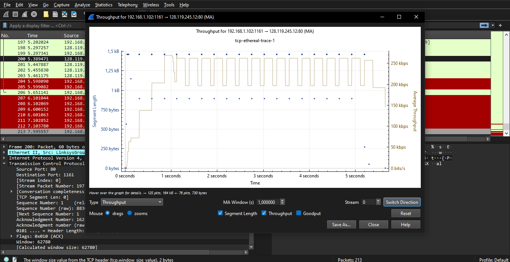

Pada kasus ini, penerima umumnya melakukan ACK untuk setiap segmen (misalnya paket No. 146 mengakui paket No. 145). Namun ditemukan juga kasus *cumulative ACK*, di mana satu paket ACK (No. 149) sekaligus mengakui dua segmen (No. 147 dan No. 148).

**9. Berapa throughput sambungan TCP ini, dan bagaimana cara menghitungnya?**

* Waktu mulai: paket No. 145 pada detik `1.602640`
* Waktu selesai: paket No. 152 pada detik `1.854215`
* Total data: `6405 - 1 = 6404 byte`
* Selisih waktu: `1.854215 - 1.602640 = 0.251575 detik`
* Throughput: `6404 / 0.251575 ≈ 25.455 byte/detik`, atau sekitar **203,64 kbps**

### Bundle 3

**Identifikasi fase slow start dan congestion avoidance pada Time-Sequence-Graph (Stevens):**

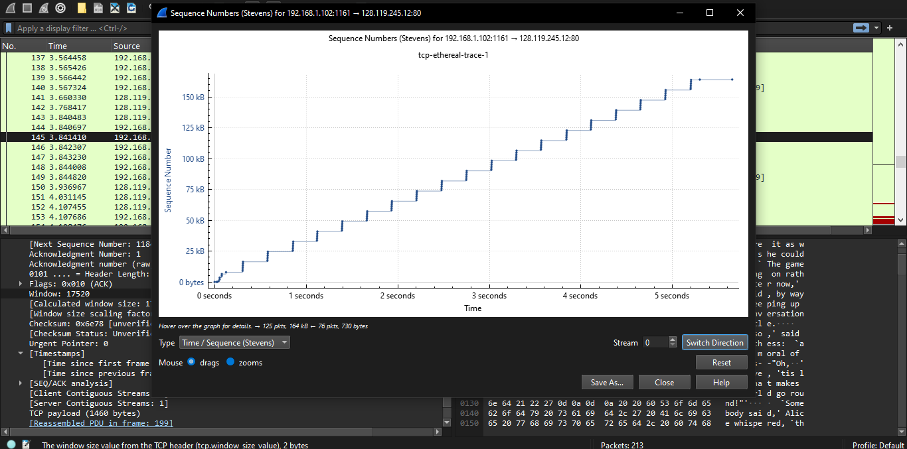

Fase **slow start** terlihat pada detik `0` sampai sekitar `0,5–0,8`, ditandai lonjakan tajam kenaikan sequence number di rentang detik 0–1. Setelah itu, masuk fase **congestion avoidance** — kalau ditarik garis, bentuknya menjadi garis diagonal yang relatif lurus, menunjukkan kenaikan window yang lebih lambat dan stabil dibanding fase sebelumnya.

---

## Kesimpulan
Modul ini menunjukkan secara langsung bagaimana TCP membangun koneksi lewat three-way handshake (SYN → SYN-ACK → ACK), mengelola pengakuan data lewat sequence number dan ACK (termasuk cumulative ACK), serta mengatur kecepatan pengiriman lewat mekanisme slow start yang kemudian melambat menjadi congestion avoidance. Semua mekanisme ini bekerja otomatis di balik satu aksi sederhana: meng-upload satu file teks ke server.
