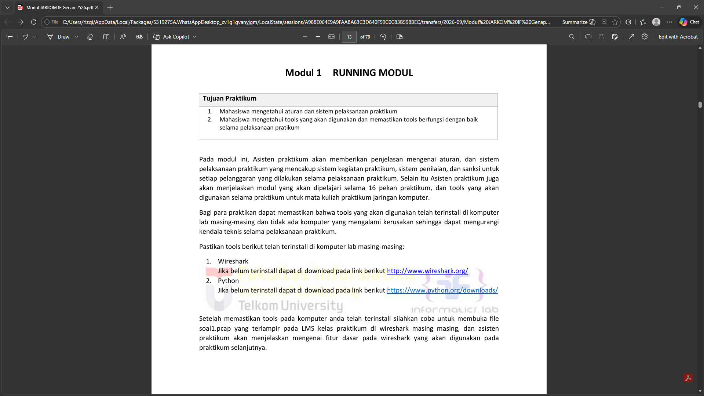
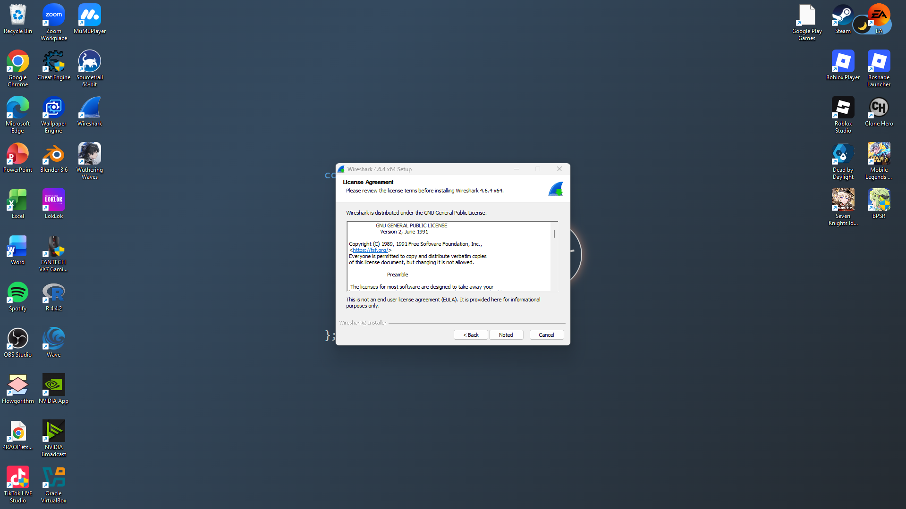
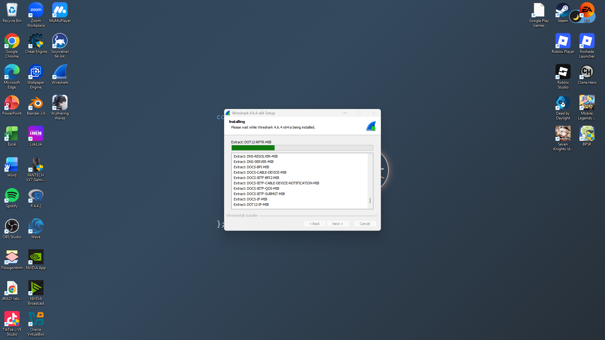
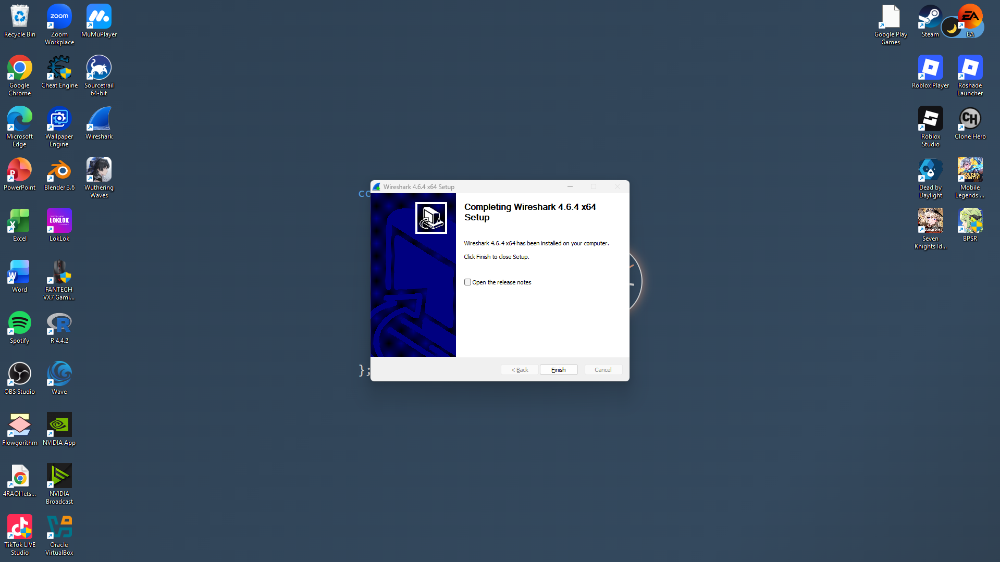
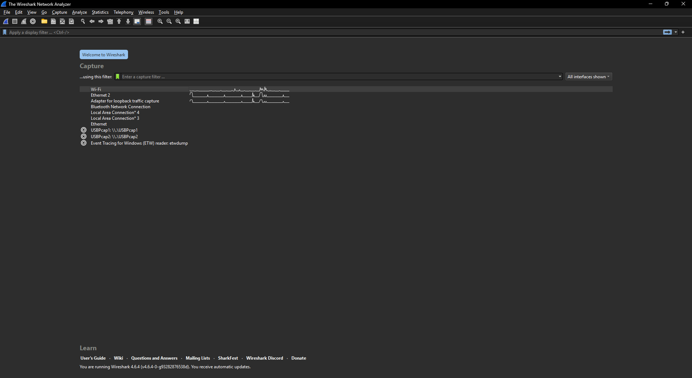
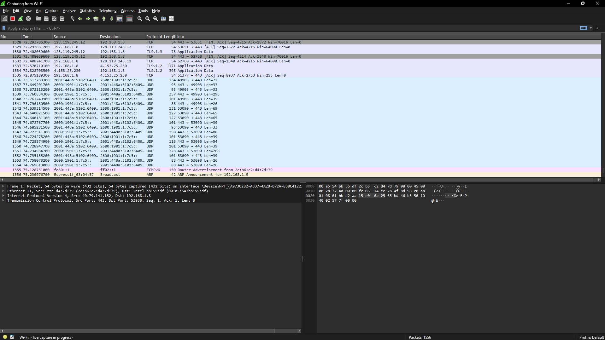
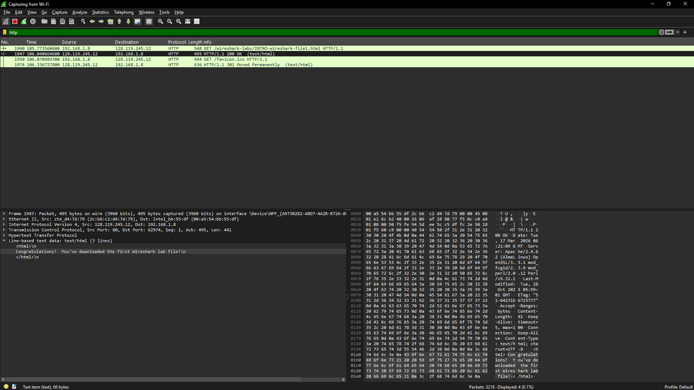

# Laporan Praktikum Jarkom Modul 1 & 2

## Tujuan Praktikum
Installasi Wireshark & Sniff Website

## Langkah Percobaan
1. Download wireshark pada link yang ada pada modul 1
2. install wireshark yang sudah didownload
3. Tunggu hingga installasi selesai
4. Buka aplikasi wireshark
5. Klik pada bagian menu wi-fi di aplikasi wireshark
6. masukkan link http://gaia.cs.umass.edu/wireshark-labs/INTRO-wireshark-file1.html pada chrome
7. buka aplikasi wireshark lagi, lalu ketik http pada bagian pencarian/filter
8. cari yang info nya HTTP/1.1 200 OK (text/html)
9. jika pada bagian bawah kiri terdapat tulisan "Congratulations! You've downloaded the first Wireshark lab file!", berarti percobaan sniff webite telah selesai

## Lampiran
Hasil percobaan : 

