# Laporan Praktikum Jarkom Modul 3

## Tujuan Praktikum
Menginvestigasi cara kerja protokol HTTP menggunakan Wireshark

## Langkah Percobaan

### A. Basic HTTP GET/response interaction

Eksplorasi HTTP dengan mengunduh file HTML yang sangat sederhana - file yang sangat pendek, dan tidak berisi objek yang disematkan

1. Jalankan browser web.
2. Jalankan packet sniffer Wireshark. Masukkan "http" di display-filter-specification window, sehingga hanya pesan HTTP yang diambil yang akan ditampilkan nanti di jendela daftar paket.
3. Tunggu sedikit lebih dari satu menit, dan kemudian mulai pengambilan paket Wireshark.
4. Masukkan link ini ke browser http://gaia.cs.umass.edu/wireshark-labs/HTTPwireshark-file1.html.
5. Hentikan pengambilan paket Wireshark.
6. Jendela Wireshark akan terlihat seperti yang ditunjukkan pada Gambar pada lampiran bagian A. Basic HTTP GET/response interaction.

### B. HTTP CONDITIONAL GET/response interaction
Sebagian besar browser web melakukan caching objek dan dengan demikian sering melakukan GET bersyarat saat mengambil objek HTTP. Sebelum melakukan langkah-langkah di bawah ini, pastikan cache browser Anda kosong. 

1. Jalankan browser web Anda, dan pastikan cache browser Anda dibersihkan.
2. Mulai tangkap paket dengan Wireshark.
3. Masukkan link berikut ke browser Anda http://gaia.cs.umass.edu/wireshark-labs/HTTPwireshark-file2.html.
4. Masukkan kembali link yang sama ke browser dengan cepat (atau cukup tekan tombol refresh di browser).
5. Hentikan pengambilan paket Wireshark, dan masukkan “http” di jendela spesifikasi filter tampilan, sehingga hanya pesan HTTP yang diambil yang akan ditampilkan nanti di jendela daftar paket.
6. Jendela Wireshark akan terlihat seperti yang ditunjukkan pada Gambar pada lampiran bagian B. HTTP CONDITIONAL GET/response interaction

### C. Retrieving Long Documents
Dalam contoh diatas sejauh ini, dokumen yang diambil adalah file HTML sederhana dan pendek. Mari lihat apa yang terjadi ketika kita mengunduh file HTML yang panjang

1. Jalankan browser web Anda, dan pastikan cache browser Anda dibersihkan
2. Mulai tangkap paket dengan Wireshark
3. Masukkan link berikut ke browser Anda http://gaia.cs.umass.edu/wireshark-labs/HTTPwireshark-file3.html.
4. Hentikan pengambilan paket Wireshark, dan masukkan “http” di jendela tampilan-filterspesifikasi, sehingga hanya pesan HTTP yang diambil yang akan ditampilkan.
5. Dalam kasus HTTP GET, entitas dalam respons adalah seluruh file HTML yang diminta. Dalam kasus ini, file HTML agak panjang, dan dengan ukuran 4500 byte terlalu besar untuk di muat dalam satu paket TCP. Di Wireshark versi terbaru, Wireshark menunjukkan setiap segmen TCP sebagai paket terpisah, dan fakta bahwa respons HTTP tunggal terfragmentasi (terbagi) menjadi beberapa paket TCP ditunjukkan oleh “TCP segment of a reassembled PDU” (segmen TCP dari PDU yang dipasang kembali), di kolom Info pada Wireshark.

### D. HTML Documents dengan Embedded Objects
Bagaimana Wireshark menampilkan lalu lintas paket yang diambil untuk ile HTML besar, kita dapat melihat apa yang terjadi ketika browser Anda mengunduh file dengan objek yang disematkan, yaitu file yang menyertakan objek lain (dalam contoh di bawah, file gambar ) yang
disimpan di server lain.

1. Jalankan browser web Anda, dan pastikan cache browser Anda dibersihkan
2. Mulai tangkap paket dengan Wireshark.
3. Masukkan link berikut ke browser Anda http://gaia.cs.umass.edu/wireshark-labs/HTTPwireshark-file4.html.
4. Browser Anda harus menampilkan file HTML pendek dengan dua gambar. Kedua gambar ini direferensikan dalam file HTML dasar. Artinya, gambar itu sendiri tidak terdapat dalam HTML; alih-alih hanya terdapat URL kedua gambar pada file HTML tersebut. Browser Anda harus mengambil logo ini dari URL situs web yang disematkan pada file HTML.
5. Hentikan pengambilan paket Wireshark, dan masukkan “http” di jendela tampilan-filterspesifikasi, sehingga hanya pesan HTTP yang diambil yang akan ditampilkan.

### E. HTTP Authentication

1. Jalankan browser web Anda, dan pastikan cache browser Anda dibersihkan
2. Mulai tangkap paket dengan Wireshark.
3. Masukkan URL berikut ke browser Anda http://gaia.cs.umass.edu/wiresharklabs/protected_pages/HTTP-wireshark-file5.html Ketik username dan password yang diminta ke dalam kotak pop up
4. Hentikan pengambilan paket Wireshark, dan masukkan “http” di jendela spesifikasi filter tampilan, sehingga hanya pesan HTTP yang diambil yang akan ditampilkan nanti di jendela daftar paket.
5. Jendela Wireshark akan terlihat seperti yang ditunjukkan pada Gambar pada lampiran bagian E. HTTP Authentication

## Lampiran

### A. Basic HTTP GET/response interaction
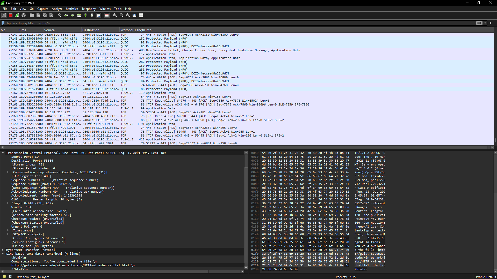
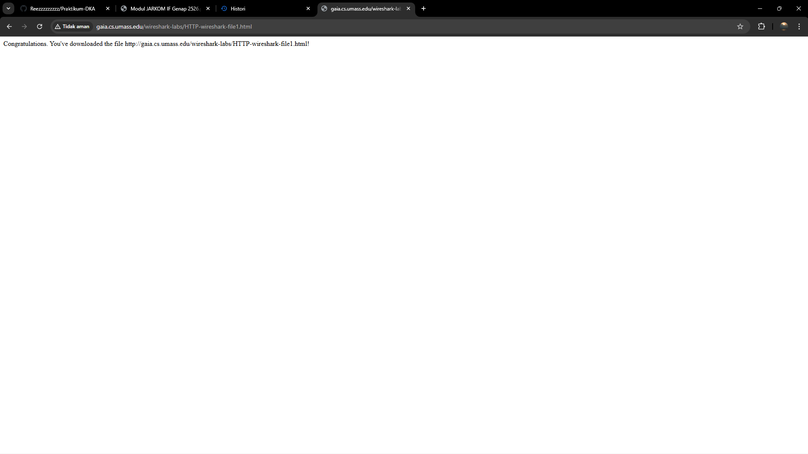
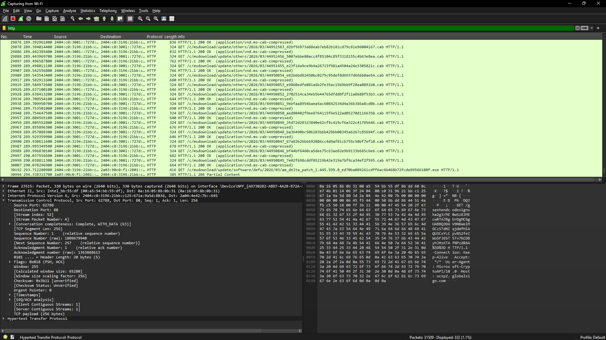

### B. HTTP CONDITIONAL GET/response interaction
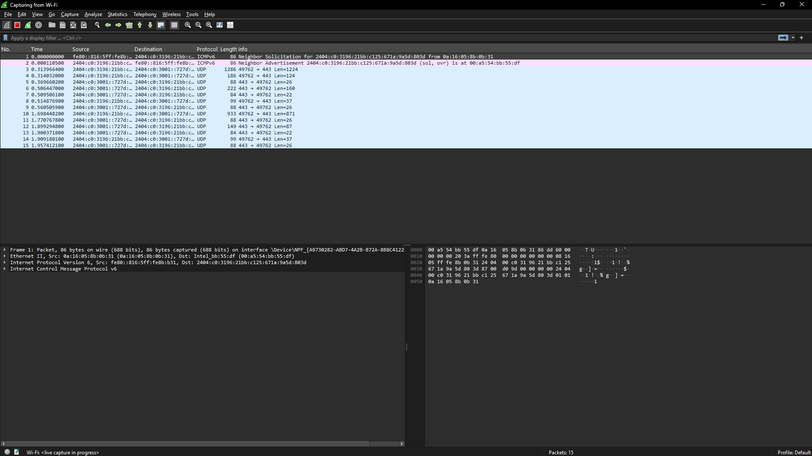
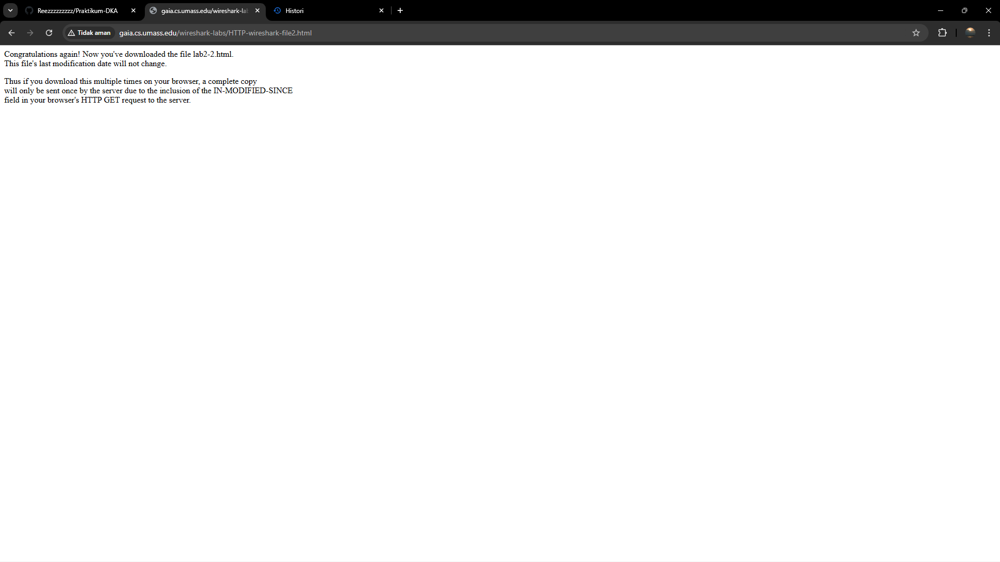
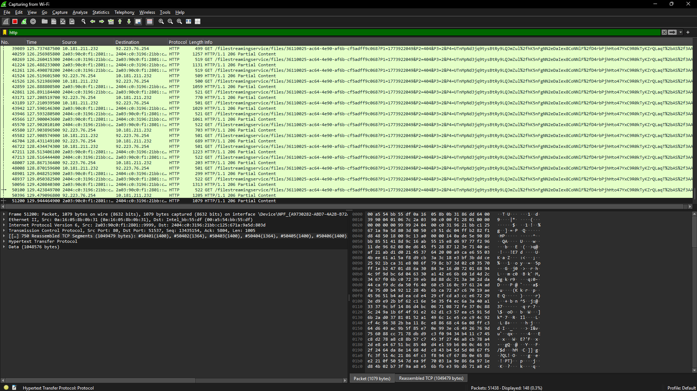

### C. Retrieving Long Documents
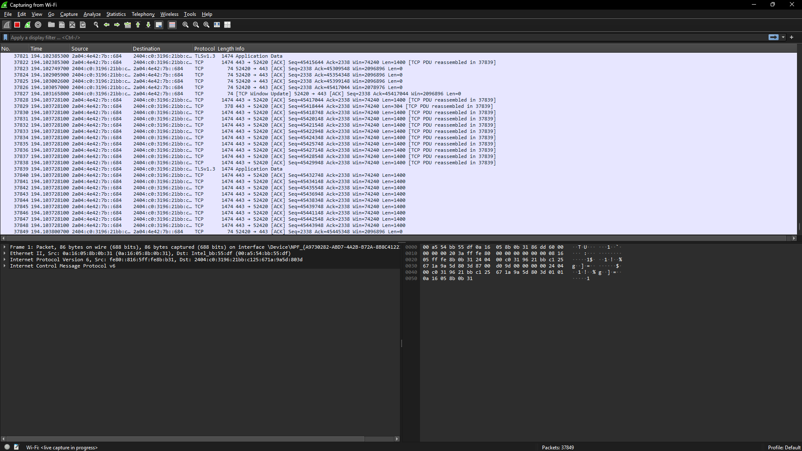
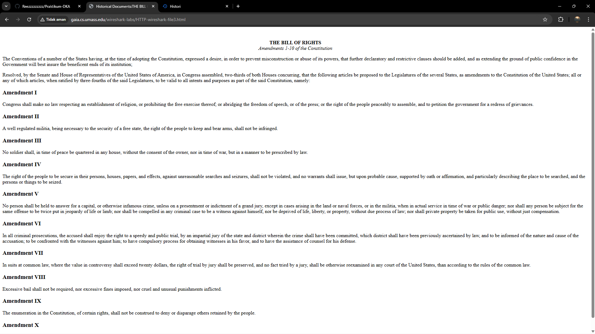
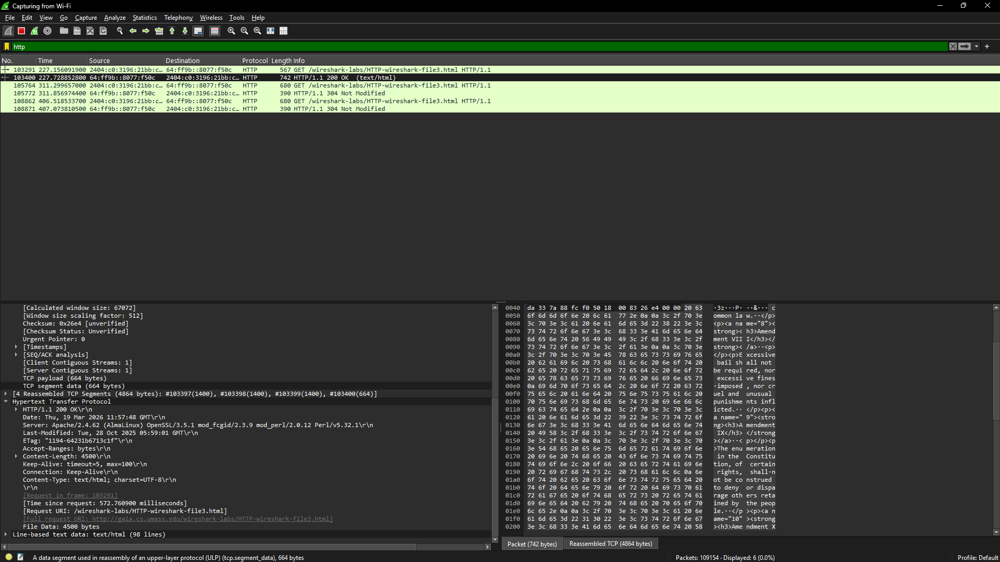

### D. HTML Documents dengan Embedded Objects
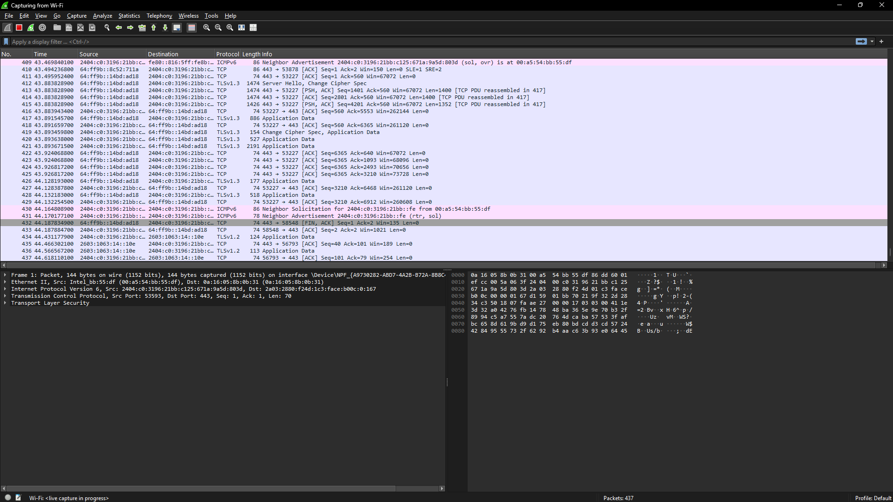
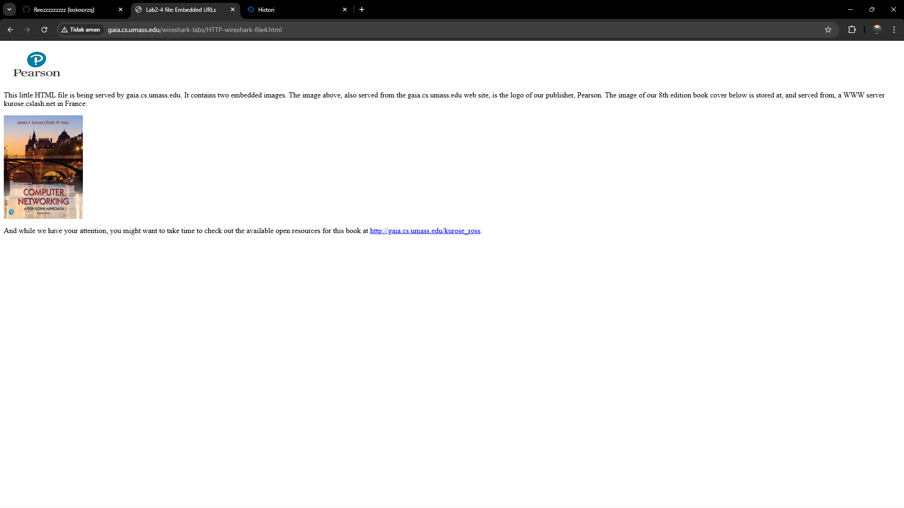
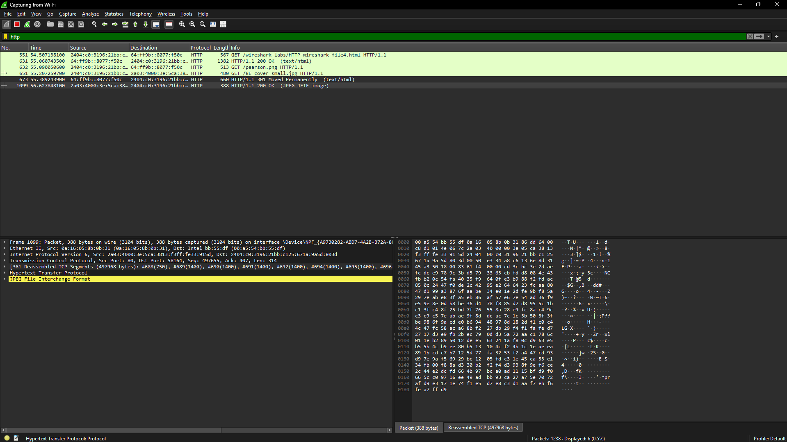

### E. HTTP Authentication
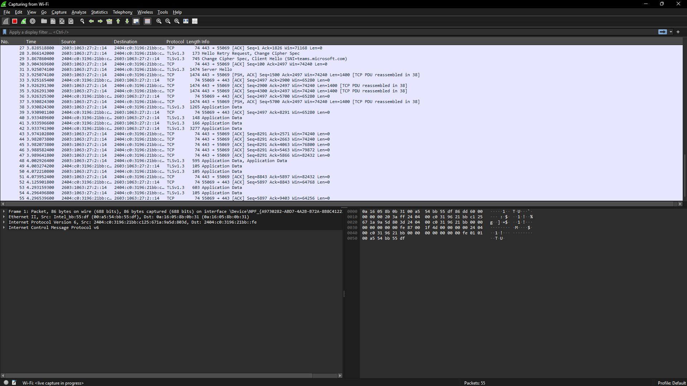
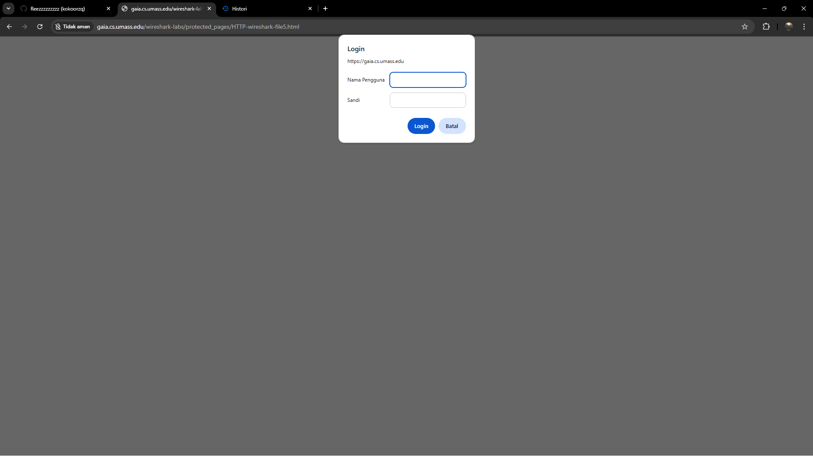
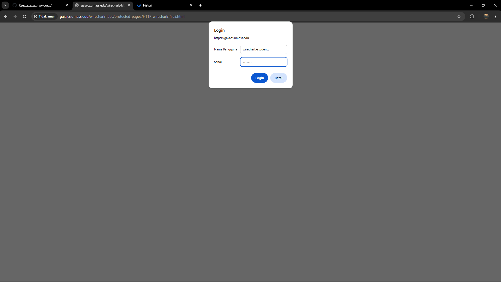
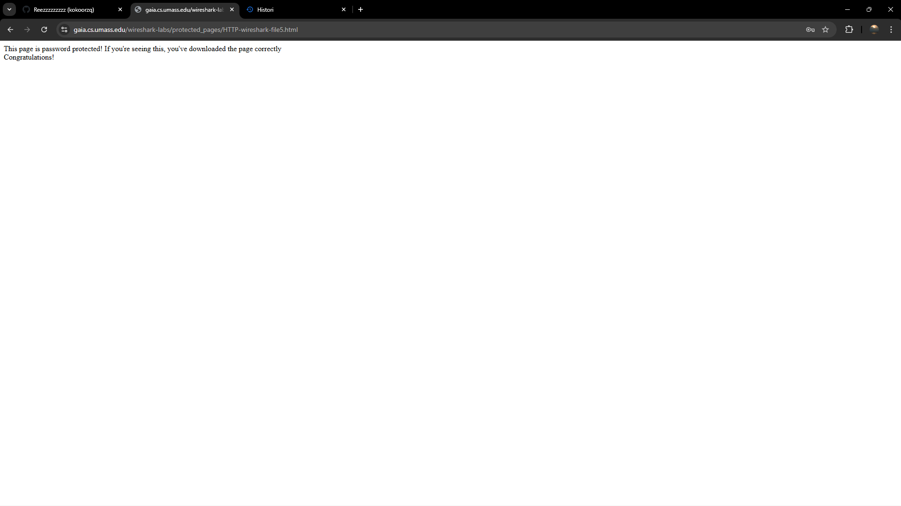
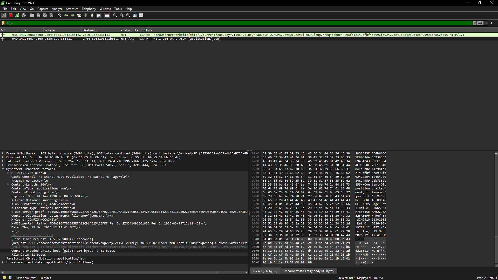

